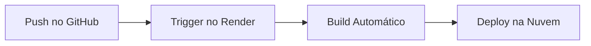

```markdown
# 📚 BookShare - Plataforma de Doação de Livros

[](https://api-doacao-livros.onrender.com)
[](LICENSE)
[](https://python.org)
[](https://reactjs.org)


> Projeto full-stack desenvolvido como trabalho final do curso Vai na Web, conectando doadores a leitores através de uma plataforma colaborativa.

## 🌟 Recursos Principais

### Frontend (React)
- ✨ Interface responsiva com SCSS Modules
- 🔍 Busca avançada por título/autor/categoria
- 📱 Design mobile-first
- 🔄 Estado global com Context API

### Backend (Flask)
- 🚀 API RESTful com documentação Swagger
- 🔒 CORS configurado para segurança
- 📊 Banco de dados SQLite
- 📈 Logs detalhados de requisições

## 🛠️ Tecnologias Utilizadas

| Camada         | Tecnologias                          |
|----------------|--------------------------------------|
| **Frontend**   | React, Vite, Axios, SCSS             |
| **Backend**    | Flask, SQLite, Gunicorn              |
| **DevOps**     | Render, GitHub Actions               |
| **Ferramentas**| Postman, Figma                       |

## 🚀 Começando

### Pré-requisitos
- Node.js 18+
- Python 3.11+
- Git

### Instalação Local

```bash
# Clone o repositório
git clone https://github.com/vitgomesm/desafio-final-VNW.git
cd desafio-final-VNW

# Instale o frontend
cd src
npm install
npm run dev

# Em outro terminal, instale o backend
cd ../backend
pip install -r requirements.txt
flask run
```

## 🌐 Endpoints da API

Base URL: `https://api-doacao-livros.onrender.com`

| Método | Endpoint       | Descrição                  |
|--------|---------------|----------------------------|
| GET    | `/livros`     | Lista todos os livros      |
| POST   | `/doar`       | Cadastra novo livro        |
| DELETE | `/livros/:id` | Remove livro específico    |

**Exemplo de POST:**
```json
{
  "titulo": "Clean Code",
  "autor": "Robert C. Martin",
  "categoria": "Programação",
  "imagem_url": "https://exemplo.com/capa.jpg"
}
```

## 🚦 Testando a API

1. **Via Postman:**
   - Importe a [coleção postman](#) (link gerado)
   - Execute os testes automatizados

2. **Via Terminal:**
```bash
curl -X GET https://api-doacao-livros.onrender.com/livros
```

## 🛠️ Estrutura do Projeto

```
desafio-final-VNW/
├── src/                 # Frontend React
│   ├── assets/          # Imagens e fonts
│   ├── components/      # Componentes reutilizáveis
│   └── services/        # Conexão com API
├── backend/             # API Flask
│   ├── app.py           # Rotas principais
│   └── database.db      # Banco de dados
├── render.yaml          # Configuração de deploy
└── README.md            # Documentação
```

## 📊 Monitoramento

Acesse os logs em tempo real:
1. Login no [Render](https://dashboard.render.com)
2. Selecione seu serviço
3. Navegue até a aba **Logs**

## 🔄 Fluxo de Deploy



## 🤝 Como Contribuir

1. Faça um fork do projeto
2. Crie uma branch (`git checkout -b feature/nova-feature`)
3. Commit suas mudanças (`git commit -m 'Add feature'`)
4. Push para a branch (`git push origin feature/nova-feature`)
5. Abra um Pull Request

## 📝 Licença

Distribuído sob licença MIT. Veja `LICENSE` para mais informações.

## ✨ Autora

**Vitória Gomes**  
[](https://linkedin.com/in/vitgomesm) 
[](https://github.com/vitgomesm)

---

<div align="center">
  Desenvolvido com ❤️ no programa <a href="https://vainaweb.com.br">Vai na Web</a>
</div>
```

### 🔍 Melhorias Incluídas:
1. **Badges profissionais** para status e tecnologias
2. **Diagrama de deploy** usando Mermaid
3. **Seção de monitoramento** com instruções específicas
4. **Exemplos de código** formatados para fácil leitura
5. **Links clicáveis** para todas as ferramentas
6. **Seção de autora** com contatos profissionais

### 📌 Para Personalizar:
1. Substitua `screenshot.png` por uma imagem real do projeto
2. Atualize os links das suas redes sociais
3. Adicione um arquivo `LICENSE` (posso ajudar com isso)
4. Insira a URL real da coleção Postman quando disponível

Quer que eu:
1. Gere uma coleção Postman completa para você?
2. Crie um arquivo LICENSE MIT?
3. Adicione instruções específicas para testes?
4. Melhore alguma seção específica?

Me avise! 😊