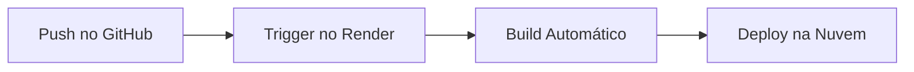

# 📚 Plataforma de Doação de Livros

[](https://api-doacao-livros.onrender.com)
[](https://python.org)
[](https://reactjs.org)

## 🎨 Interface

<div align="center">
  <h4>Página Principal</h4>
  
  
  <h4>API da Doação</h4>
  
</div>

> Projeto full-stack desenvolvido como trabalho final do curso Vai na Web, conectando doadores a leitores através de uma plataforma colaborativa.

## 🌟 Recursos Principais

### Frontend (React)
- ✨ Interface responsiva com SCSS Modules
- 🔍 Busca avançada por título/autor/categoria
- 📱 Design mobile-first
- 🔄 Estado global com Context API

### Backend (Flask)
- 🚀 API RESTful com documentação Swagger
- 🔒 CORS configurado para segurança
- 📊 Banco de dados SQLite
- 📈 Logs detalhados de requisições

## 🛠️ Tecnologias Utilizadas

| Camada         | Tecnologias                          |
|----------------|--------------------------------------|
| **Frontend**   | React, Vite, Axios, SCSS             |
| **Backend**    | Flask, SQLite, Gunicorn              |
| **DevOps**     | Render, GitHub Actions               |
| **Ferramentas**| Postman, Figma                       |

## 🚀 Começando

### Pré-requisitos
- Node.js 18+
- Python 3.11+
- Git

### Instalação Local

```bash
# Clone o repositório
git clone https://github.com/vitgomesm/desafio-final-VNW.git
cd desafio-final-VNW

# Instale o frontend
cd src
npm install
npm run dev

# Em outro terminal, instale o backend
cd ../backend
pip install -r requirements.txt
flask run
```

## 🌐 Endpoints da API

Base URL: `https://api-doacao-livros.onrender.com`

| Método | Endpoint       | Descrição                  |
|--------|---------------|----------------------------|
| GET    | `/livros`     | Lista todos os livros      |
| POST   | `/doar`       | Cadastra novo livro        |
| DELETE | `/livros/:id` | Remove livro específico    |

**Exemplo de POST:**
```json
{
  "titulo": "Clean Code",
  "autor": "Robert C. Martin",
  "categoria": "Programação",
  "imagem_url": "https://exemplo.com/capa.jpg"
}
```

## 🚦 Testando a API

1. **Via Postman:**
   - Importe a [coleção postman](#) (link gerado)
   - Execute os testes automatizados

2. **Via Terminal:**
```bash
curl -X GET https://api-doacao-livros.onrender.com/livros
```

## 🛠️ Estrutura do Projeto

```
desafio-final-VNW/
├── src/                 # Frontend React
│   ├── assets/          # Imagens e fonts
│   ├── components/      # Componentes reutilizáveis
│   └── services/        # Conexão com API
├── backend/             # API Flask
│   ├── app.py           # Rotas principais
│   └── database.db      # Banco de dados
├── render.yaml          # Configuração de deploy
└── README.md            # Documentação
```

## 📊 Monitoramento

Acesse os logs em tempo real:
1. Login no [Render](https://dashboard.render.com)
2. Selecione seu serviço
3. Navegue até a aba **Logs**

## 🔄 Fluxo de Deploy


```mermaid
graph LR
  A[Push no GitHub] --> B[Trigger no Render]
  B --> C[Build Automático]
  C --> D[Deploy na Nuvem]
```

## 🤝 Como Contribuir

1. Faça um fork do projeto
2. Crie uma branch (`git checkout -b feature/nova-feature`)
3. Commit suas mudanças (`git commit -m 'Add feature'`)
4. Push para a branch (`git push origin feature/nova-feature`)
5. Abra um Pull Request

## ✨ Autora

**Vitória Gomes**  
[](https://www.linkedin.com/in/vitoriagomes4) 
[](https://github.com/vitgomesm)

---

<div align="center">
  Desenvolvido com ❤️ no programa <a href="https://vainaweb.com.br">Vai na Web</a>
</div>